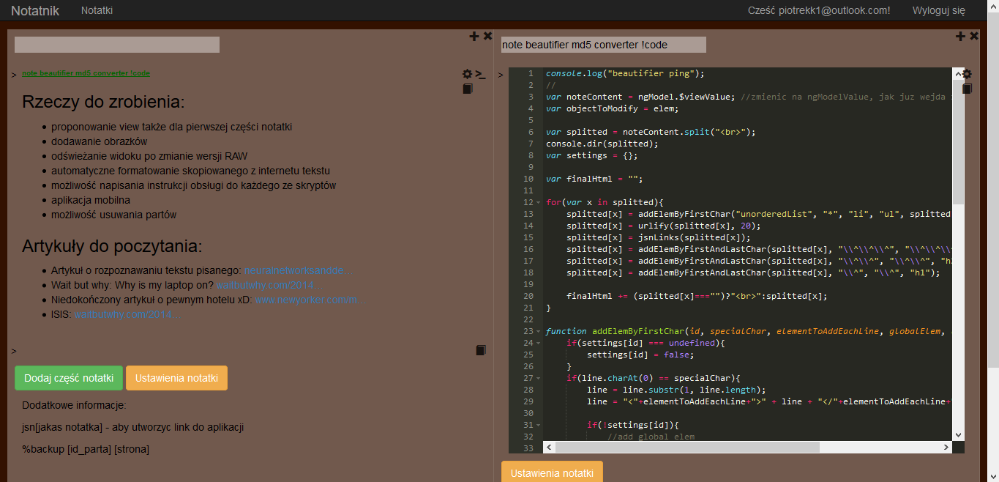

# Console Notepad
Aplikacja oparta o Web API i AngularJS. Ma za zadanie przechowywaæ i wyœwielaæ notatki.

Adres: [JSNotepad](http://jsnotepad.azurewebsites.net/)

Funkcje:

* Zapisuje notatki w czasie rzeczywistym
* Umo¿liwia pisanie kodu JS (tworzenie dodatkowych funkcji bezpoœrednio w aplikacji)
* Zapisuje historiê edytowanych notatek
* Ogólnie jest zajebisty

